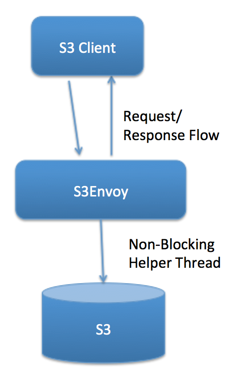
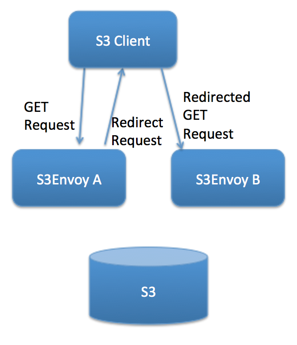
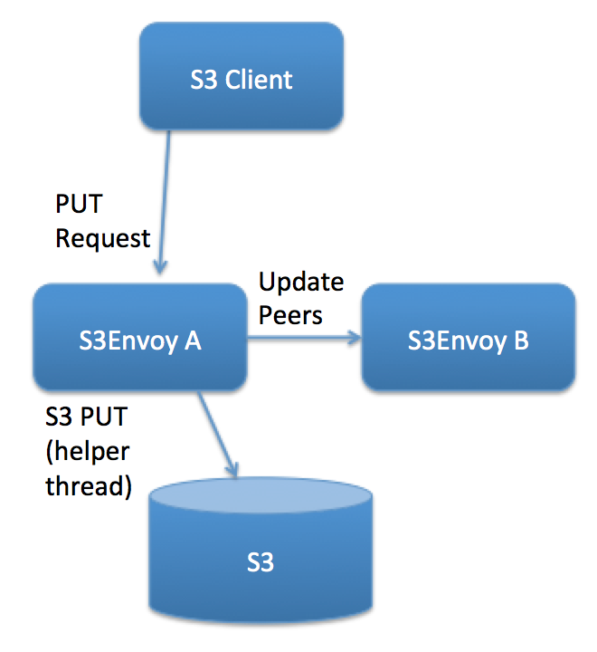

# s3envoy
S3Envoy is an S3 Proxy layer to cache objects local to the application's environment but still ultimately backed by S3

##Motivation
As a Smart Docs Company, Nitro uses S3 quite a bit and for a variety of purposes.  But S3 operations are relatively heavy operations and might not be the best design in some cases.  For Nitro's Hack Week I hypothesized performance could be improved simply by keeping recently used objects/files warm in a more local store instead of sending all the way to the AWS S3 service.  Part of the logic behind this reasoning also has to do with behavior and usage patterns; files/objects which are PUT are recently are more likely to be retrieved in the near future.  Despite all this, these objects still should be ultimately backed by S3, but we can use non-blocking helper threads for that.

##Installation
To install simply clone the project into your Go enviroment and run "go install s3envoy/s3proxy"

Prerequisites include:
* [Hashicorp's memberlist library ](https://github.com/Nitro/memberlist)
* [The Gorrila mux router](https://github.com/gorilla/mux)
* [AWS SDK](https://github.com/aws/aws-sdk-go)
* [Pivotal's byte converter](github.com/pivotal-golang/bytefmt)

